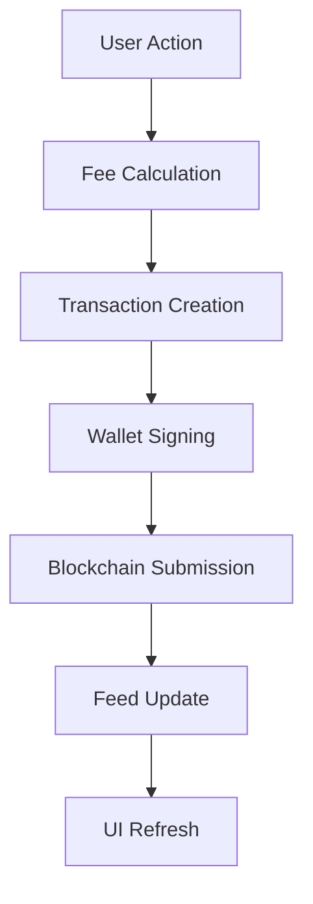

# Verum Frontend

Angular 19 frontend application for the Verum protocol built on Kaspa.

### Protocol Features

- **Posts & Stories**: Create content with markdown support and long-form stories
- **Comments & Likes**: Engage with content while supporting creators
- **Subscriptions**: Follow users with direct payment support
- **Private Notes**: Encrypted personal notes stored on blockchain
- **Profile Management**: Decentralized user profiles with avatar support

## Project Structure

This Angular 19 application follows a modular, service-oriented architecture:

```
src/
├── app/
│   ├── components/
│   │   ├── layout/           # Layout components (header, sidebars, navigation)
│   │   ├── pages/            # Route components (dashboard, profile, wallet)
│   │   ├── ui/               # Reusable UI components (buttons, cards, inputs)
│   │   └── user/             # User-specific components
│   ├── services/             # Business logic and API services
│   │   ├── kaspa-api.service.ts          # Kaspa blockchain API
│   │   ├── kaspa-transaction.service.ts  # Transaction creation/signing
│   │   ├── fee-calculation.service.ts    # Dynamic fee calculation
│   │   ├── encryption.service.ts         # Note encryption/decryption
│   │   ├── feed.service.ts               # Social feed generation
│   │   ├── user.service.ts               # User profile management
│   │   └── wallet-manager.service.ts     # Wallet integration
│   ├── types/                # TypeScript type definitions
│   └── shared/               # Shared utilities and configurations
├── environments/             # Environment-specific configurations
└── styles/                   # Global styles and theming
```

## Packages Architecture

This project uses a modular package architecture with three core packages that provide different levels of abstraction for the Verum protocol:

### Package Overview

```
packages/
├── verum-protocol/         # Core protocol implementation
├── verum-index/            # Blockchain data indexing and fetching
└── verum-sdk/              # High-level SDK combining protocol and indexing
```

### @verum/protocol

**Core transaction creation and validation for the Verum social protocol**

```typescript
import { VerumTransactionBuilder, PayloadValidator } from '@verum/protocol';
```

#### Key Features
- **Transaction Builders**: Create properly formatted Verum transactions
- **Payload Validation**: Validate transaction payloads against protocol specs
- **Story Chunking**: Split long content into multiple transaction segments
- **Protocol Constants**: Version numbers, size limits, and validation rules

#### Main Components
- `VerumTransactionBuilder` - Build transactions for all operation types
- `PayloadValidator` - Validate payloads before blockchain submission
- `StoryChunker` - Handle long-form content segmentation
- Protocol constants and type definitions

#### Usage Example
```typescript
const builder = new VerumTransactionBuilder();
const postPayload = builder.createPostPayload({
  content: "Hello Verum!",
  version: "0.3"
});
```

### @verum/index

**Blockchain data fetching and indexing for efficient social media operations**

```typescript
import { VerumIndexer } from '@verum/index';
```

#### Key Features
- **Blockchain Fetching**: Retrieve transactions from Kaspa blockchain
- **Data Aggregation**: Combine related transactions (stories, comments, likes)
- **Engagement Tracking**: Track likes, comments, and social metrics
- **Performance Optimization**: Caching and batching for fast data access
- **User Profile Resolution**: Efficient profile lookup with v0.2+ optimizations

#### Main Components
- `VerumIndexer` - Main indexing service with caching
- `BlockchainFetcher` - Raw blockchain data retrieval
- `UserFetcher` - User-specific data fetching and profile resolution
- `FeedAggregator` - Aggregate and sort feed content
- `StoryReconstructor` - Reassemble multi-segment stories

#### Usage Example
```typescript
const indexer = new VerumIndexer({
  kaspaApiUrl: "https://api.kaspa.org",
  network: "mainnet"
});

const userFeed = await indexer.getUserFeed(userAddress);
const storySegments = await indexer.getStorySegments(firstTxId);
```

### @verum/sdk

**High-level TypeScript SDK combining protocol operations and blockchain indexing**

```typescript
import { VerumSDK } from '@verum/sdk';
```

#### Key Features
- **Unified Interface**: Single SDK for all Verum operations
- **Wallet Integration**: Support for KasWare, Kastle, and other wallets
- **Transaction Management**: Automatic confirmation tracking and retry logic
- **Feed Management**: Personalized, global, and trending feeds
- **Story Creation**: Multi-segment story creation with progress tracking
- **Event System**: Real-time updates for transactions and feeds
- **User Operations**: Registration, following, profile management

#### Main Components
- `VerumSDK` - Main SDK class with all operations
- `WalletManager` - Multi-wallet support and connection management
- `UserOperations` - User registration, profiles, and social actions
- `ContentOperations` - Posts, comments, likes creation
- `StoryOperations` - Multi-segment story creation and management
- `FeedManager` - Feed generation and caching
- `TransactionConfirmationService` - Track transaction status

#### Usage Example
```typescript
const sdk = new VerumSDK({
  kaspaApiUrl: "https://api.kaspa.org",
  network: "mainnet",
  wallet: kasWareWallet
});

await sdk.initialize();
const post = await sdk.createPost({ content: "Hello Verum!" });
const feed = await sdk.getPersonalizedFeed({ limit: 20 });
```

### Building Packages

The packages must be built in dependency order:

```bash
# Build in correct order
cd packages/verum-protocol && npm install && npm run build
cd ../verum-index && npm install && npm run build
cd ../verum-sdk && npm install && npm run build

# Or use the convenience script (if available)
npm run build:packages
```

## Getting Started

### Installation

1. **Clone the repository**

2. **Install dependencies**
   ```bash
   npm install
   ```

3. **Start development server**
   ```bash
   ng serve
   # or
   npm start
   ```

4. **Open browser**
   Navigate to `http://localhost:4200/`

The application will automatically reload when you modify source files.

### Environment Configuration

The application supports different environments:

- **Development**: `src/environments/environment.ts`
- **Production**: `src/environments/environment.prod.ts`

Configure API endpoints, network settings, and feature flags in these files.

## Architecture Overview

### Verum Protocol Integration

The frontend integrates with the Verum protocol v0.3, supporting:

**Transaction Types**
   - START: User profile creation
   - POST: Content creation
   - COMMENT: Post interactions
   - LIKE: Content appreciation
   - SUBSCRIBE/UNSUBSCRIBE: User following
   - STORY: Long-form content (v0.2+)
   - NOTE: Private encrypted notes (v0.3+)

### Transaction Payload Parameters

Each Verum transaction type has specific payload parameters and requirements:

#### START Transaction (User Registration)
**Purpose**: Create or update user profile

```typescript
{
  verum: "0.3",                    // Protocol version
  type: "start",                   // Transaction type
  content: "nickname|avatar_b64",  // Username and optional base64 avatar
  timestamp: 1234567890           // Unix timestamp
  // Note: start_tx_id not included (this IS the start transaction)
}
```

#### POST Transaction (Content Creation)
**Purpose**: Create new posts with markdown content

```typescript
{
  verum: "0.3",                    // Protocol version
  type: "post",                    // Transaction type
  content: "Markdown content...",  // Post content in markdown
  timestamp: 1234567890,          // Unix timestamp
  prev_tx_id: "abc123...",        // Previous transaction in user's chain
  last_subscribe: "def456...",     // Last subscription transaction
  start_tx_id: "ghi789..."        // User's START transaction ID
}
```

#### COMMENT Transaction (Post Interaction)
**Purpose**: Comment on posts, stories, or notes

```typescript
{
  verum: "0.3",                    // Protocol version
  type: "comment",                 // Transaction type
  content: "Comment text...",      // Comment content
  timestamp: 1234567890,          // Unix timestamp
  parent_id: "target_post_id",    // Post/story first segment ID
  prev_tx_id: "abc123...",        // Previous transaction in user's chain
  start_tx_id: "ghi789..."        // User's START transaction ID
}
```

#### LIKE Transaction (Content Appreciation)
**Purpose**: Like posts or stories

```typescript
{
  verum: "0.3",                    // Protocol version
  type: "like",                    // Transaction type
  content: null,                   // Always null for likes
  timestamp: 1234567890,          // Unix timestamp
  parent_id: "target_post_id",    // Post/story first segment ID
  prev_tx_id: "abc123...",        // Previous transaction in user's chain
  start_tx_id: "ghi789..."        // User's START transaction ID
}
```

#### SUBSCRIBE Transaction (Follow User)
**Purpose**: Follow another user

```typescript
{
  verum: "0.3",                    // Protocol version
  type: "subscribe",               // Transaction type
  content: "target_user_address",  // Address of user being followed
  timestamp: 1234567890,          // Unix timestamp
  prev_tx_id: "abc123...",        // Previous transaction in user's chain
  last_subscribe: "def456...",     // Previous subscription transaction
  start_tx_id: "ghi789..."        // User's START transaction ID
}
```

#### UNSUBSCRIBE Transaction (Unfollow User)
**Purpose**: Unfollow a previously followed user

```typescript
{
  verum: "0.3",                    // Protocol version
  type: "unsubscribe",             // Transaction type
  content: "target_user_address",  // Address of user being unfollowed
  timestamp: 1234567890,          // Unix timestamp
  prev_tx_id: "abc123...",        // Previous transaction in user's chain
  last_subscribe: "def456...",     // Last subscription transaction
  start_tx_id: "ghi789..."        // User's START transaction ID
}
```

#### STORY Transaction (Long-form Content)
**Purpose**: Create multi-segment long-form content

```typescript
{
  verum: "0.3",                    // Protocol version
  type: "story",                   // Transaction type
  content: "Story segment...",     // Content for this segment
  timestamp: 1234567890,          // Unix timestamp
  parent_id: "prev_segment_id",   // Previous segment ID (null for first)
  prev_tx_id: "abc123...",        // Previous transaction in user's chain
  start_tx_id: "ghi789...",       // User's START transaction ID
  params: {
    segment: 2,                    // Current segment number (1-based)
    total: 5,                      // Total expected segments (optional)
    is_final: false                // True for the last segment
  }
}
```

#### NOTE Transaction (Private Encrypted Content)
**Purpose**: Create private encrypted notes (v0.3+ only)

```typescript
{
  verum: "0.3",                    // Protocol version
  type: "note",                    // Transaction type
  content: "encrypted_b64_data",   // AES-GCM encrypted content (base64)
  timestamp: 1234567890,          // Unix timestamp
  prev_tx_id: "abc123...",        // Previous transaction in user's chain
  last_subscribe: "def456...",     // Last subscription transaction
  start_tx_id: "ghi789..."        // User's START transaction ID
}
```

#### Common Payload Rules

**Required Fields**:
- `verum`: Protocol version ("0.1", "0.2", or "0.3")
- `type`: Transaction type identifier
- `timestamp`: Unix timestamp when transaction was created

**Optional Fields**:
- `content`: Transaction-specific content (null for likes)
- `parent_id`: Reference to parent transaction (comments, likes)
- `prev_tx_id`: Previous transaction in user's chain (chain integrity)
- `last_subscribe`: Last subscription transaction (subscription chain)
- `start_tx_id`: User's START transaction ID (v0.2+ optimization)

**Size Constraints**:
- Maximum total payload: **1000 bytes** (JSON encoded)
- Content field: ~800-900 bytes (varies by metadata overhead)
- All strings are UTF-8 encoded

**Version Compatibility**:
- v0.1: Basic fields (verum, type, content, timestamp, parent_id, prev_tx_id)
- v0.2: Added start_tx_id field and STORY support
- v0.3: Added NOTE transaction type with encryption

### Wallet Integration

Supports multiple Kaspa wallets:
- **KasWare**: Browser extension wallet
- **Future**: Additional wallet integrations

### Data Flow



## Contributing

1. **Fork the repository**
2. **Create feature branch**: `git checkout -b feature/new-feature`
3. **Make changes** following the coding standards
4. **Test thoroughly** with unit and integration tests
5. **Submit pull request** with detailed description
